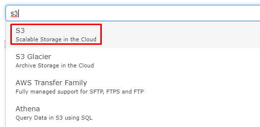
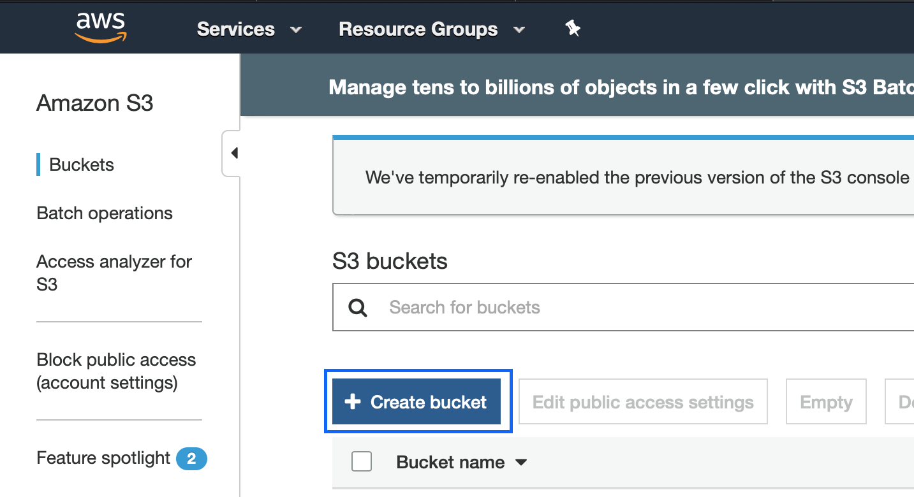
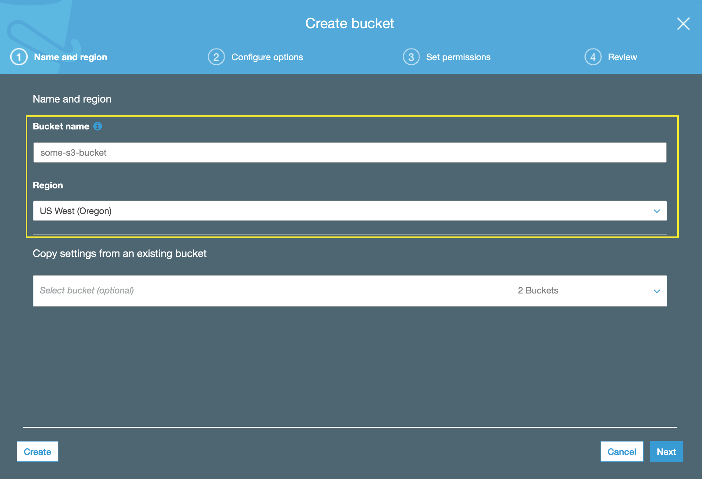
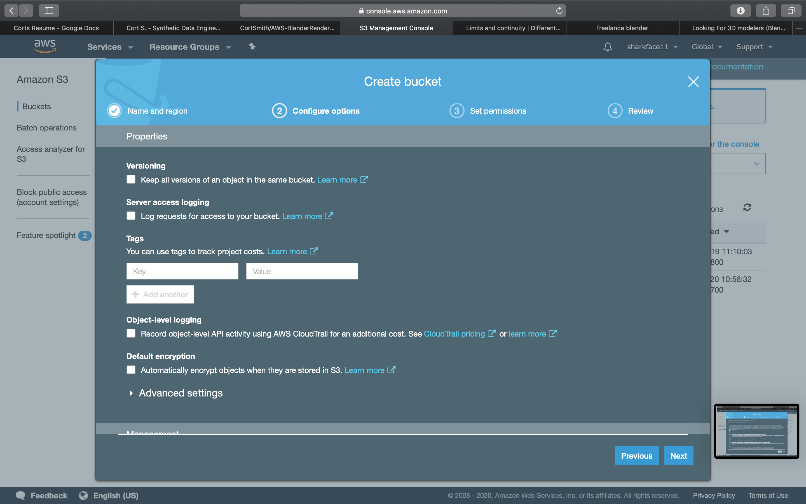
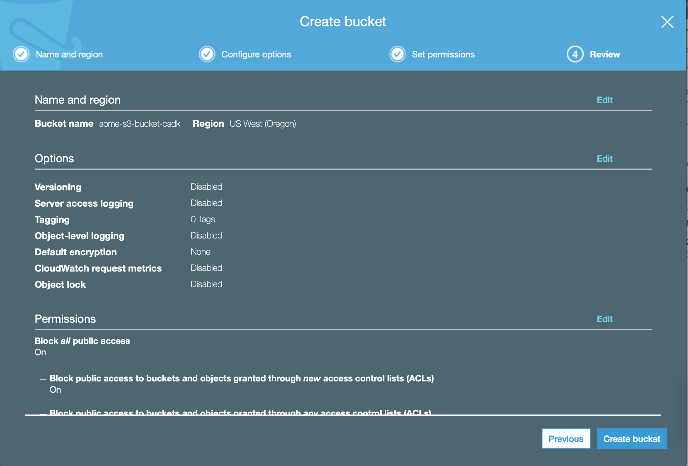
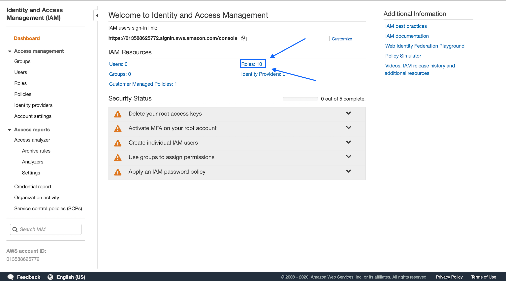
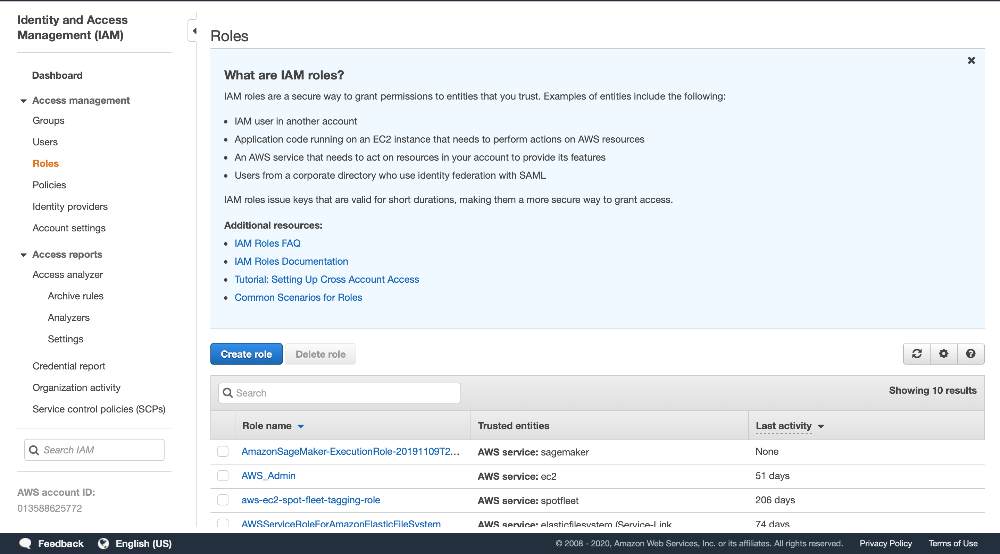
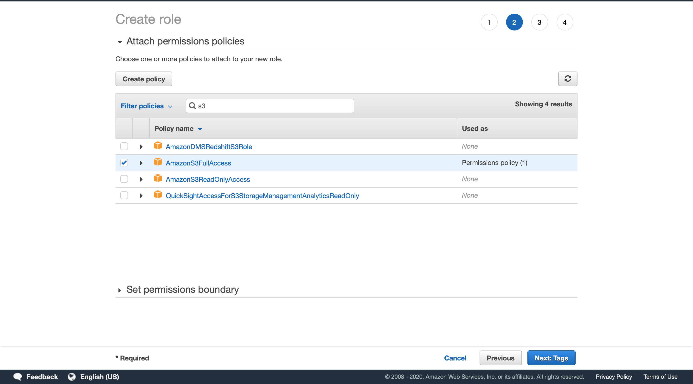

# AWS-BlenderRendering

## Steps to begin rendering images with blender on AWS EC2

### Step 1 -- Create an S3 Bucket for Blender output files
  * Setup S3 storage
    * Click the Services dropdown at the top left of the website.
    * Navigate to the search bar and enter "S3".
    
    * Click the Create Bucket button.
    
    * Give it a name; must be unique among all buckets on the internet.
    * Select the region you will be running your ec2 instance from.
    
    * Skip the next two sections. 
        Those are additional options for more control over bucket access, and
        versioning.
    
    
    * Look over the settings of your bucket and click Create
    
    * Take note of your S3 bucket name, you will need it if you want access to it from the aws cli on 
    your own computer or ec2 instance.
    
### Step 2 -- Create an IAM Role and Security Group
  * Search IAM under the Services tab.
  * Find and select the Roles section. It should be located on the initial page.
  
  * Select Create Role, to create a new role for our ec2 instance.
  
  * Select the EC2 use case.
  
  * Now to add our permissions, search S3 and choose 'AmazonS3FullAccess'.
    * Ideally we would select specific functions that our ec2 instance would require, however, 
    for this tutorial we will simply use full access.
    
  * The name must be unique across all S3 buckets anyone has created.
    * The description should describe its use case, for our case we are using this 
    bucket for storing our blender rendering output images.
  
  * Launch EC2 instance
  * Connect to your instance
  * Install dependencies and software
