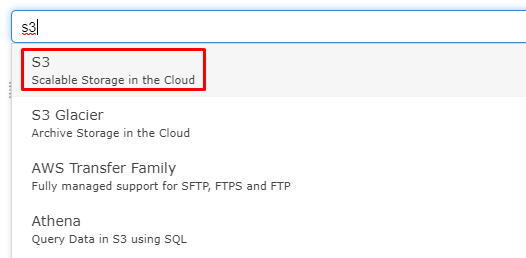

# AWS-BlenderRendering
**Description**

## Steps to begin rendering images with blender on AWS EC2
### Step 1
  * Make an aws account
  * Setup S3 storage
    * Click the **Services** dropdown at the top left of the website.
    * Navigate to the search bar and enter "S3"
    
    
    
    * Click the **Create Bucket** button.
    * Give it a name; must be unique among all buckets on aws.
    * Select the region you will be running your ec2 instance from.
    * Skip the next two sections by clicking **Next**. 
        Those are additional options you don't have to worry about.
    * Finally click **Create Bucket**
    * Take note of your S3 bucket name, you will need it if you want access to it from the aws cli on 
    your own computer or ec2 instance.
  
  * EC2 Pre-setup
    
    Next we will need to setup a security group and an IAM role for the ec2 instance.
    * Click the **Services** dropdown at the top left of the website.
    * Navigate to the search bar and enter "IAM"
    * Click **Roles** under the middle section **IAM Resources**
    * Click **Create Role**
    * Choose the **EC2** option under **Common Use Cases** and click **Next: Permissions**
    * Find the search bar and enter *s3*, and select **AmazonS3FullAccess**
    * Click **Next:Tags**
    * Click **Next:Review**
    * Give your role a name, and click **Create Role**

  * 
  
  * Launch EC2 instance
    * 
  * Connect to your instance
    * 
  * Install dependencies and software
    * 
