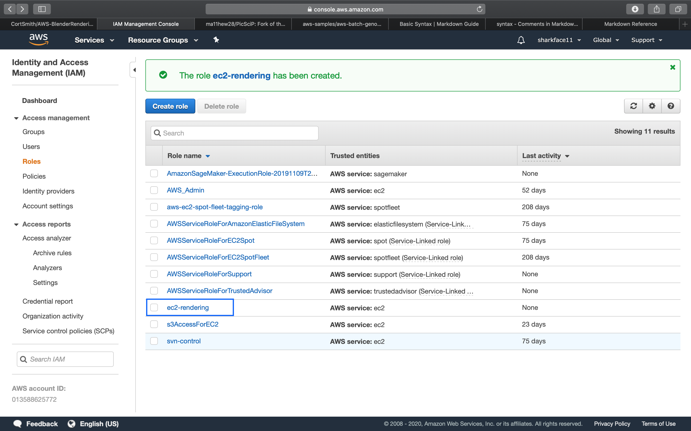

# AWS-BlenderRendering

Learn how to programmatically render thousands of images using 
Amazon Web Services, Blender, and Python.

---

## Pre-requisites

- [AWS CLI (Windows)(Optional)](https://docs.aws.amazon.com/cli/latest/userguide/install-cliv2-windows.html)

- [Python (3.7.6)(Optional)](https://www.python.org/downloads/release/python-376/)

- [Putty](https://www.chiark.greenend.org.uk/~sgtatham/putty/latest.html)

---

## Server-side Dependencies

- [Git]()

- [Blender 2.83](`https://github.com/blender/blender.git`)

- [Precompiled Libraries for Blender]()

[//]: # (Instruction to download folder from google drive in the main folder)

- [Source Folder (Large Files)]('https://drive.google.com/drive/folders/1jm3LDtZSYOE3teynZF2hbYkgmkEnJnPH?usp=sharing')

    - Command to download source folder via cli --> wget --no-check-certificate 'https://docs.google.com/uc?export=download&id=FILEID' -O FILENAME

---

### Create an S3 Bucket for Blender output files

- Setup S3 storage
    
    - Click the Services dropdown at the top left of the website.
    
    - Navigate to the search bar, enter "S3", and select the option named __S3__.
    
    - Click the Create Bucket button.
    
    - Give it a name; must be unique among all buckets on the internet.
        
        - For this tutorial, I will be naming mine 'render-output'.
    
    - Select the region you will be running your ec2 instance from.
        
        - For this tutorial, I will be running in US West (Oregon).
    
    - Skip the next two sections. 
        Those are additional options for more control over bucket access, and
        versioning bucket objects (aka, your files; versioning allows you to overwrite files 
        with the same name, but keeping the original versions as copies).
    
    - Look over the settings of your bucket and click Create
    
    - Take note of your S3 bucket name, you will need it if you want access to it from the aws cli on 
    your own computer or ec2 instance.
    
    - This is what your bucket should look like:
    
    
    
    
---

### Create an IAM Role and Security Group

  - Search IAM under the Services tab and select the option named __IAM__.
  
  - Find and select the Roles section. It should be located in the middle column of the page, under __IAM Resources__
  
  - Select Create Role, to create a new role for our ec2 instance.
  
  - Select the EC2 use case and click __Next: Permissions__ button at the bottom right of the page.
  
  - Now to add our permissions, search S3 and choose 'AmazonS3FullAccess', then click __Next: Tags__ at the bottom right of the page.
    
    - Ideally we would select specific functions that our ec2 instance would require, however, 
    for this tutorial we will simply use full access.
  
  - Click __Next: Review__ at the bottom right of the page.
  
    - We don't need to add any tags to the IAM Role.
  
  - Enter the name and description and click create.
    
    - For this tutorial, I will name it ec2-rendering.
  
  - The description should describe its use case.
    
    - For this tutorial, we will alter the filler description by adding 'S3' to it:
    
      - Allows EC2 instances to call AWS S3 services on your behalf.
  
  - This is what you should see after you create the role:
  
  

---

### [Optional] - Setup an EC2 instance volume.

-Volumes are storage blocks that allow you to save your files without having to re-download files, 
software, and other dependencies.

- Navigate to the EC2 Dashboard by searching EC2 under the Services tab and selecting the option named __EC2__.

- In the left column, find the Elastic Block Store section, and select Volumes.

- Click Create Volume.

- Adjust the Size (GiB) value to a size in gigabytes that suits your needs.

  - I generally wouldn't go over 100 gigabytes, but you will probably want around 10 - 20 minimum.
  
- Set the Availability Zone to us-west-2a.

  - Take note of that, you will need to launch your EC2 instance in the same Availability Zone to access it. 

- Add a tag:

  - In the first section enter 'Name', in the second section enter 'ec2-rendering'.
  
- Click __Create Volume__ at the bottom right and you're done!


---

### Creating a Security Group

- Search EC2 in the Services tab search bar and navigate to the EC2 dashboard.

- On the left-hand side column there is a list of services for ec2. \
Under Network & Security, find and select Security Groups.

- On the top left of the page, click the Create Security Group button.

- Enter a name and description.
  
  - For this tutorial, I will be setting these to:
  
    - Name -> ec2-rendering
    - Description -> Key for ec2 rendering instances

- For simplicities sake, we will adding only one rule for All Traffic.

- Under _Inbound Rules_, click Add Rule.

  - Change the Type to SSH.

  - Change Source to My IP

  - Leave _Outbound Rules_ as is. Outbound rules are set to allow all outgoing traffic to any IP by Default.
  
  - Click __Create__ on the bottom right of the window.
  
- Keep in mind you can change the Inbound and Outbound Rules at any time to adjust to your current needs, or 
requirements, such as, allowing other ip's to connect and not just yours.


---

### Creating a Key Pair

- Key-pairs are used to connect to aws via ssh encryption, to keep your connection secure. 
Keys are also required in order to connect to your ec2 instance.

- Key pairs are encrypted keys used to connect to aws services, and are required to connect to EC2.

- Navigate to the EC2 Dashboard by searching 'EC2' in the services tab at the top of the website page.

- Find 'Network & Security' tab, and select 'Key Pairs'.

- On the top left, click 'Create Key Pair'

- Enter a name.
  
  - For this tutorial, I will be naming mine 'ec2-rendering'
  and setting the file format to '.pem'

- Click Create Key Pair, and download the key file. Make sure you save the key file to your hard drive, otherwise 
you will need to recreate your key, there is no other way to get a copy of your key pair.


---

### Launch your EC2 instance

- Search EC2 in the services tab search bar and select the option named "EC2"

- Find the Instances section in the left column, and click Instances below.

- Click Launch Instance.

- Now to choose your AMI, we will be using the `Ubuntu Server 16.04 LTS (HVM), SSD Volume Type`.

  - An AMI stands for Amazon Machine Image
  
  - You can search an AMI by its code in the search bar, 
  the ami we are using has the code: `ami-008c6427c8facbe08`,
  which you can search for in the search bar.

- Choosing an Instance Type, we are using the `t2.large`. 

  - Note: I attempted to run this script on free tier (t2.micro), but ran out of memory prior to actual image rendering.
  
[//]: # (Perhaps, a very small blender file could render on Free tier.)
    
  - Normally we would select a filter above the instance type list and set it to GPU Instances and choose one of 
  these, but for our sake, this will work for tutorial purposes. Everything we do here will work on any other 
  instance type

- Configuration setup, starting from the top look for each item listed below, all other items are fine as default.

    - Purchasing Options -> check the box: `Request Spot Instances`, leave all other settings as default.
    
    - Subnet             -> `subnet-2a1bfe52 | Default in us-west-2a`
    
    - IAM role           -> `ec2-rendering`

- Click __Next: Storage__

- Click __Next: Add Tags__ 

    - Storage will be left as default.
    We will attach our Volume later on after we start the instance.

- Click __Add Tag__ and add a tag with the first section as 'Name', second section as 'ec2-rendering'
  
  - This will give our instance a name that we can see to identify our instance

- Click __Next: Configure Security Group__
    
- Set your security group

  - Click the bubble, Select an existing security group, and find your security group in the list
    
    - Look under the Name section to find it.

- Then click review and launch and click launch on the following page.

- And you're done!

---

### Attaching Volume to EC2 Instance

- Navigate to the EC2 Dashboard

- Look at the left column, and find the section labeled "Elastic Block Store", and select Volumes

- Find your volume and select it.

- Above the volumes list there are two buttons, click the one labeled Actions and select Attach Volume

- Select the text box next to Instance and find your instance, look for the name you gave your instance upon prior to
launch, and select it and click Attach.

---

### Connect to your instance

- There are many ways to connect to your instance, I will cover two ways, SSH and Putty SSH.
  - SSH is the most portable solution, Putty is the simpler windows version.

- Navigate to the EC2 Dashboard from the Services tab.

- Find the Instances section on the left column and select Instances.

- Find your ec2 instance that is currently running and select it.

- Find the button above your instances list labeled Actions and select Connect.

- Copy the line of code at the bottom of that info screen.

  - Should look similar to this: `ssh -i "ec2-rendering.pem" ubuntu@ec2-54-190-22-239.us-west-2.compute.amazonaws.com`

  - However, you will need to change the line in quotations after the (-i) to the location on your hard drive that the 
  pem file is located - e.g. "C:/Program Files/SSH/ec2-rendering.pem"
  
  - It is helpful to copy this line to a text file and change it then copy/paste it into a command prompt.
  
- Open a command prompt, you can do this by opening the start menu and searching cmd.

- If you are using putty, you will be able to set the location of the .pem file you downloaded, set the ip address you 
want to connect to, and save that to a profile so you dont have to set those values again.

  - If your connection reports a Timeout error, go to the Security Groups section of the EC2 dashboard, select your security group. Below the list of security groups select the Inbound tab and click edit. Where the _Source_ column is change that to _My IP_ and try connecting again.

- Once you are connected, we need to install the dependencies that we need.

---

### Mounting your volume

- At this point our volume is available in the form of a file in our root directory. We need to mount this file to a directory somewhere convenient within the root/home/ubuntu/ directory where we have write access.

- [AWS Documentation] (https://docs.aws.amazon.com/AWSEC2/latest/UserGuide/ebs-using-volumes.html) on mounting attached volumes. The below is a quick code sequence to get your volume up and running.

- We need to create a directory to mount our new storage volume. 

- Then we need to identify our volume in the root directory and setup our volume with a filesystem.

  - Currently it doesn't have any sort of filesystem it's simply an empty shell.
  
  ```
  sudo mkdir workspace
  lsblk 
  ```
  
  - The command lsblk shows us the filesystems currently on our system, we are looking for traits that match our attached volume (this method will be difficult if you have multiple volumes attached.

  - Our volume has 100gb of storage space, and has no filesystem or mountpoint. So We check the list of partitions attached to our system and first check the SIZE column, if it matches and there is only one then that is ours, if there are multiple and one has a mountpoint then ours is the one WIHTOUT a mountpoint.

  - And that narrows ours down to `xvdf 202:80 0 100G 0 disk`
  
  
  
    - This command checks a partition if it has a filesystem or not

    `sudo file -s /dev/xvdf`
  
  - Then we create a filesystem on that partition (our volume).

  ```
  sudo mkfs -t xfs /dev/xvdf
  ```

  - Finally to mount it to the folder.

  ```
  sudo mount /dev/xvdf /home/ubuntu/workspace
  cd workspace
  ```

TIPS:

When we connect to our ec2 instance, we are (by default) inside the folder /home/ubuntu. We also have write access to files only within this directory. Without `sudo` we cannot execute alot of commands.

Also, all partitions are located within the /dev directory on linux ec2.

---

### Install dependencies

- There is a good bit of setup within the server that needs to be done prior to running our script and getting our 
rendered images from blender. The following will be a series of commands used, in order, to install all dependencies 
required for us to run the script on blender.

- The below is a package manager update, and package installation.

```commandline
sudo apt-get update
sudo apt-get install build-essential git subversion cmake libx11-dev libxxf86vm-dev libxcursor-dev libxi-dev libxrandr-dev libxinerama-dev libglew-dev

git clone https://github.com/CortSmith/blender-2.83.git

git clone https://github.com/CortSmith/AWS-BlenderRendering.git
```

- If you cd into the blender directory you'll notice 3 files with the ending .z01, .z02, and .zip -- We need to combine these and unzip them to retrieve blender.

```commandline
sudo apt-get install zip unzip

zip -FF split-blender-2.83.0-linux64.zip --out fixed-split-blender-2.83.0-linux64.zip

unzip fixed-split-blender-2.83.0-linux64.zip

rm split-blender-2.83.0-linux64.*
rm fixed-split-blender-2.83.0-linux64.zip
```

- We also need to do reassemble our source folder and unpack it and move it to another directory.

```commandline
cat xa* > source.zip
unzip source.zip
mv source/* ../AWS-BlenderRendering/source/
```

- Unzip the Room.zip file, this is the blender file we will be rendering images from.

```commandline
cd /home/ubuntu/AWS-BlenderRendering/source/
unzip Room.zip
```

- Once everything is set, if you are NOT using the bucket name I used, you will need to set the name you will be using prior to running the script.

- I've made a config file with a couple variables in there, one allows you to test your render script to make sure it works. 
And the other is the s3 bucket name that the script will use to upload all of your images generated.

- In the command prompt you used to connect to the ec2 instance, while still connected, 
type `vim ./AWS-BlenderRendering/source/data.json`

- Find the 's3' variable and WITHIN the quotes, change the text to the name of your s3 bucket verbatim otherwise the 
script will stop and give you an error.

```commandline
./build_linux/bin/blender --background ./AWS-BlenderRendering/source/Room.blend --python ./AWS-BlenderRendering/source/renderImages.py
```

[//]: # (Steps that have yet to be setup.)
- After the build finished, you will find blender ready to run in ~/blender-git/build_linux/bin.
- clone the git repo in a common repository
- run blender in the background on your script and blender project file.
- project files should upload directly to your s3 bucket as it renders images.

---

### Expenses

